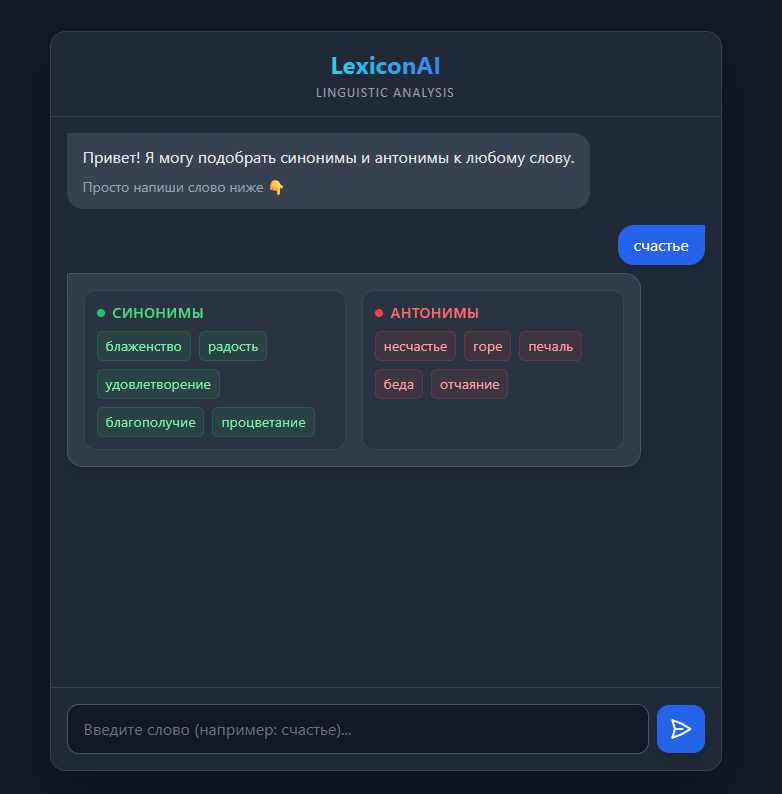

# LexiconAI

**LexiconAI** — это высокотехнологичная экосистема для глубокого лингвистического анализа, объединяющая возможности современных больших языковых моделей (LLM) и гибких графовых алгоритмов обработки данных. Сервис предоставляет пользователям не просто поиск синонимов и антонимов, а интеллектуальное исследование смысловых связей слов на естественном языке.

Проект спроектирован как универсальное решение с поддержкой различных LLM-провайдеров, позволяя гибко переключаться между облачными API (OpenAI, Groq, OpenRouter) и собственными локальными моделями. Благодаря интеграции с **LangGraph**, каждый запрос проходит через структурированный цикл обработки, обеспечивая высокую точность и предсказуемость результата.




---

## 🚀 Быстрый запуск

### С использованием Docker (рекомендуется)

1. **Клонируйте репозиторий:**

    ```bash
    git clone https://github.com/AndreyKilanov/LexiconAI.git
    cd LexiconAI
    ```

2. **Настройте переменные окружения:**
    Скопируйте файл `.env.example` в `.env` и укажите настройки вашего LLM провайдера (API ключ, модель, базовый URL):

    ```bash
    cp .env.example .env
    ```

3. **Запустите проект:**

    ```bash
    docker-compose up -d --build
    ```

После запуска сервис будет доступен по адресу: [http://localhost](http://localhost)

### Валидация данных

Система включает строгую валидацию входных данных:

- **Кириллица:** Анализ доступен только для слов на русском языке (кириллица).
- **Одно слово:** Ввод должен состоять из одного слова без пробелов.
- **Длина:** Ограничение на длину слова (до 50 символов).

---

## 🛠 Технологический стек

- **Backend:** FastAPI (0.109.2)
- **AI Оркестрация:** LangChain (1.2.10) + LangGraph (1.0.8)
- **LLM Конекторы:** Совместимость с любым OpenAI-like API (Groq, OpenRouter, self-hosted)
- **Database:** PostgreSQL 15 + SQLAlchemy 2.0.46 (Async)
- **Migrations:** Alembic 1.18.4
- **Telegram Bot:** aiogram 3.22.0
- **Frontend:** Jinja2 + HTMX + Tailwind CSS
- **Infrastructure:** Docker, Nginx
- **Logging:** Structlog 24.4.0

---

## 📖 Документация и ссылки

- **Веб-чат (локально):** [http://localhost](http://localhost)
- **Интерактивная документация API (Swagger):** [http://localhost/docs](http://localhost/docs)
- **Альтернативная документация API (ReDoc):** [http://localhost/redoc](http://localhost/redoc)
- **Подробное описание функционала:** [docs/features.md](docs/features.md)
- **Инструкция по веб-интерфейсу:** [docs/web_interface.md](docs/web_interface.md)
- **Инструкция по Telegram-боту:** [docs/telegram_bot.md](docs/telegram_bot.md)
- **Техническое задание:** [docs/Technical%20Spec.md](docs/Technical%20Spec.md)

---

## 🏗 Разработка

### Локальная установка без Docker

1. Установите [Poetry](https://python-poetry.org/docs/#installation).
2. Установите зависимости:

    ```bash
    poetry install
    ```

3. Активируйте виртуальное окружение:

    ```bash
    poetry shell
    ```

4. Запустите миграции:

    ```bash
    alembic upgrade head
    ```

5. Запустите приложение:

    ```bash
    uvicorn src.app.main:app --reload
    ```

---

## 👥 Контакты

Автор: [Andrey Kilanov](https://github.com/AndreyKilanov)
